# VBTest - 智能化英语词汇量自适应测试系统

VBTest 是一款基于 **IRT (Item Response Theory, 项目反应理论)** 的智能化英语词汇量评估系统。它能够根据用户的答题表现实时调整题目难度，通过极少量的题目采集（通常 20-50 题）精准评估用户的词汇量储备，并生成深度定制的 HTML 诊断报告。

## 🚀 技术亮点

### 1. 核心算法：自适应难度调整
系统内置 IRT 算法模型，具备以下特性：
- **实时能力估算**：每答对或答错一题，系统都会根据题目难度权重实时更新用户的“能力值（Theta）”。
- **最优题目选择**：系统会自动从 8000+ 词库中选取与当前能力值最匹配的单词，确保测试效率最大化。
- **防止蒙题机制**：支持“以上都不对”和“我不会”选项，并可根据答题正确率开启能力值惩罚。

### 2. 现代化的报告引擎
`ReportGenerator` 采用了高度解耦的设计：
- **视觉美学**：基于 Tailwind CSS 构建，采用 Emerald Green（翡翠绿）作为品牌色，搭配 High-contrast Orange（橙色）作为重点强调色。
- **架构解耦**：生成逻辑与文件 IO 分离，既支持生成物理 `.html` 文件，也支持直接返回 HTML 源码字符串供外部集成（如 Web 服务）。

### 3. 可扩展的领域模型
代码遵循领域驱动设计（DDD）理念：
- **Domain 层**：封装了 IRT 核心算法、词库管理及测试模型。
- **Application 层**：提供了 `TestService` 统一入口，简化调用逻辑。

---

## 📂 项目结构

```text
src/main/java/
├── application/             # 应用层
│   ├── ReportGenerator.java # 诊断报告生成引擎（核心）
│   ├── TestService.java    # 对外统一服务接口
│   └── TestManager.java    # 测试流程管理
├── domain/                  # 领域层
│   ├── algorithm/          # IRT 算法实现
│   ├── model/              # 核心对象模型 (User, Question, TestResult)
│   └── WordBank.java       # 词库加载与管理
└── Main.java                # 控制台交互入口
```

---

## 🛠 使用方法

### 1. 编译与运行
项目采用 Gradle 构建，推荐使用以下命令启动：

```bash
# 编译并运行控制台交互程序
./gradlew build
java -cp build/classes/java/main Main
```

### 2. 分步测试流程
1. **录入信息**：输入学生姓名。
2. **初始能力设置**：根据学生学段（小学/初中/高中/大学）设置 0.0 - 7.5 的初始能力值，加速算法收敛。
3. **交互答题**：系统逐题推送单词，支持 1-7 数字键选择选项。
4. **结果输出**：测试完成后，控制台显示总结果，并自动在 `report/` 文件夹下生成带时间戳的 HTML 报告。

---

## 🔗 外部集成指南 (External Integration Guide)

VBTest 采用了分层架构，使得外部系统（如 Web 后端、移动端 API 或桌面 App）可以轻松集成核心测试引擎。

### 1. 核心生命周期 (Testing Lifecycle)

集成 VBTest 时，通常遵循以下生命周期：

```mermaid
graph LR
    Init[初始化 WordBank] --> Start[创建 TestService]
    Start --> User[配置 UserModel]
    User --> Loop[答题循环]
    Loop --> Finish[结束并获取 TestResult]
    Finish --> Report[生成 HTML 源码/文件]
```



### 2. 初始化核心组件
首先需要加载词库并初始化服务入口：

```java
// 1. 加载词库 (推荐单例化，因为词库文件较大)
WordBank wordBank = new WordBank("data/your_word_bank.csv");

// 2. 选择自适应算法并初始化 TestService
IRTAlgorithm algorithm = new IRTAlgorithm(wordBank);
TestManager manager = new TestManager(algorithm, wordBank);
TestService service = new TestService(manager);
```

### 3. 配置测试用户
外部系统可以通过 `UserModel` 传递现有的用户信息，或设置初始能力建议：

```java
UserModel user = new UserModel("db_id_1001", "李华");

// [可选] 设置初始能力 (0.0-7.5)。如果已有用户的学段信息，建议设置以加快收敛速度。
// 3.0 ≈ 初中水平, 5.0 ≈ 高中水平
user.setAbilityEstimate(3.0); 
user.setInitialAbility(3.0);
user.setCustomInitialAbility(true); // 设置为 true 报告中会显示初始值

service.initiateTest(user);
```

### 4. 驱动答题循环
在测试过程中，通过 `TestService` 持续获取题目并推送答案：

```java
while (!service.isTestFinished()) {
    // 获取下一题（包含单词、选项、难度等信息）
    Question question = service.provideNextQuestion();
    
    // ... 在 UI 展示给用户并获取用户选定的索引 userAnswerIndex ...
    
    // 提交答案，内部会根据 IRT 算法自动调整能力评估
    boolean isCorrect = question.isCorrect(userAnswerIndex);
    service.processAnswer(question, isCorrect);
    
    // [可选] 获取实时统计用于进度条或实时看板
    String stats = service.getRealTimeStats();
}
```

### 5. 处理测试结果与报告
测试结束后，最重要的步骤是获取 `TestResult` 并利用 `ReportGenerator` 生成可视化内容：

```java
// 1. 结束测试并获取汇总结果
TestResult result = service.concludeTest();

// 2. [Web 场景] 直接获取 HTML 字符串用于前端渲染或邮件推送
// 该方法全内存计算，不涉及磁盘 IO。
String htmlSource = ReportGenerator.buildHtml(result);

// 3. [离线场景] 将报告持久化为物理文件
ReportGenerator.generateReport(result, "reports/my_report.html");
```

---

## 📊 报告特性
- **品牌设计**：无顶部粗边框的极简卡片式设计。
- **多维分析**：包含预估词汇量、能力段位（小学至大学+）、错题深度解析。
- **统计信息**：自动统计总题数、错误数及实时正确率。
- **文件名规范**：建议的命名规范为 `vocabulary_report_{用户名}_{时间戳}.html`。

---

## 📝 词库配置
词库文件位于根目录（如 `test_v9.6.csv`），格式如下：
`ID, 英文单词, 中文含义, 难度等级(1.0-7.5)`

---

*© 2026 家庭CEO 伴学*
